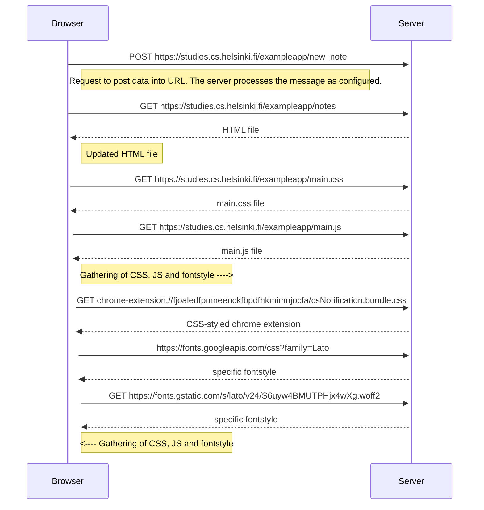

```mermaid
sequenceDiagram;
    Browser->>+Server: POST https://studies.cs.helsinki.fi/exampleapp/new_note;
    Note right of Browser: Request to post data into URL. The server processes the message as configured.;
    Browser->>+Server: GET https://studies.cs.helsinki.fi/exampleapp/notes;
    Server-->>+Browser: HTML file;
    Note right of Browser: Updated HTML file;
    Browser->>+Server: GET https://studies.cs.helsinki.fi/exampleapp/main.css;
    Server-->>+Browser: main.css file;
    Browser->>+Server: GET https://studies.cs.helsinki.fi/exampleapp/main.js;
    Server-->>+Browser: main.js file;
    Note right of Browser: Gathering of CSS, JS and fontstyle ---->;
    Browser->>+Server: GET chrome-extension://fjoaledfpmneenckfbpdfhkmimnjocfa/csNotification.bundle.css;
    Server-->>+Browser: CSS-styled chrome extension;
    Browser->>+Server: https://fonts.googleapis.com/css?family=Lato;
    Server-->>+Browser: specific fontstyle;
    Browser->>+Server: GET https://fonts.gstatic.com/s/lato/v24/S6uyw4BMUTPHjx4wXg.woff2;
    Server-->>+Browser: specific fontstyle;
    Note right of Browser: <---- Gathering of CSS, JS and fontstyle;
```
