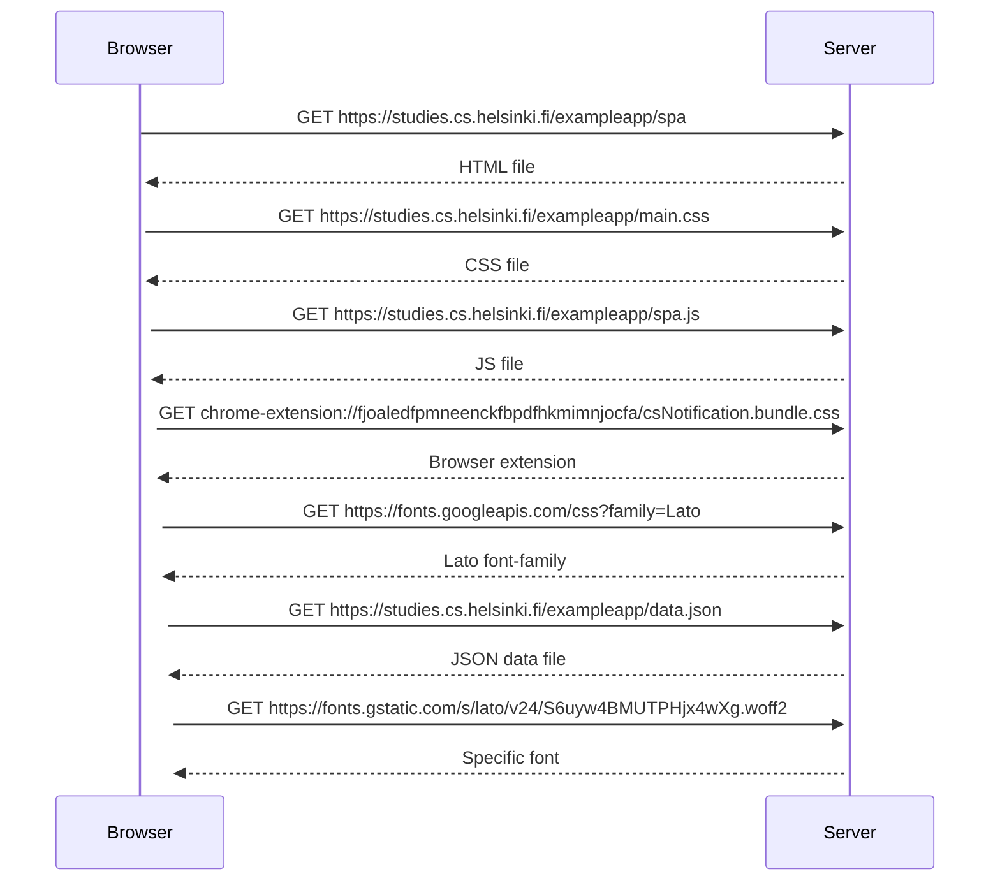

```mermaid
sequenceDiagram;
    Browser->>+Server: GET https://studies.cs.helsinki.fi/exampleapp/spa;
    Server-->>+Browser: HTML file;
    Browser->>+Server: GET https://studies.cs.helsinki.fi/exampleapp/main.css;
    Server-->>+Browser: CSS file;
    Browser->>+Server: GET https://studies.cs.helsinki.fi/exampleapp/spa.js;
    Server-->>+Browser: JS file;
    Browser->>+Server: GET chrome-extension://fjoaledfpmneenckfbpdfhkmimnjocfa/csNotification.bundle.css;
    Server-->>+Browser: Browser extension;
    Browser->>+Server: GET https://fonts.googleapis.com/css?family=Lato;
    Server-->>+Browser: Lato font-family;
    Browser->>+Server: GET https://studies.cs.helsinki.fi/exampleapp/data.json;
    Server-->>+Browser: JSON data file;
    Browser->>+Server: GET https://fonts.gstatic.com/s/lato/v24/S6uyw4BMUTPHjx4wXg.woff2;
    Server-->>+Browser: Specific font;
```
